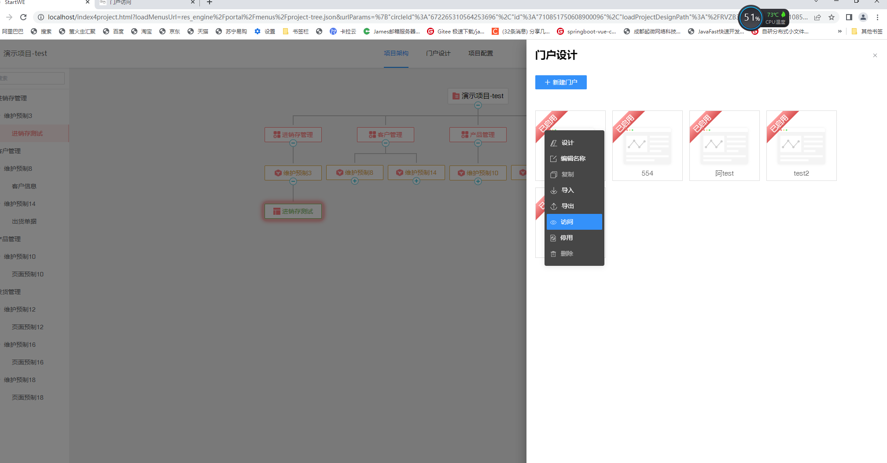
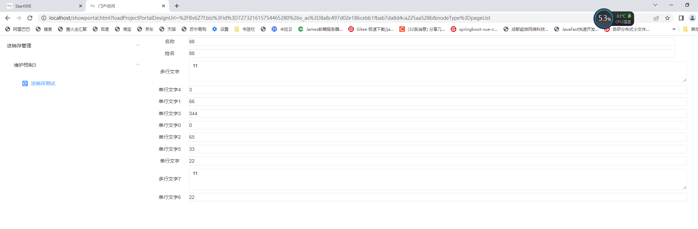

# startwe2.0
Startwe轻量级开源低代码框架 让天下没有难做的项目    
#### 介绍
针对startwe1.0的升级版本

#### 我是谁,从哪里来
Startwe低代码架构之路
       
       早在2018年，我拉着两个兄弟就已经在策划零代码、低代码的可视化开发工具。今天给大家分享一下研发心得。
       
       首先得解释几个名词概念：

       零代码、免代吗、无代码：都属于同一类定义，基于软件工具的拖拽、配置而无需写代码的方式实现一些通用类软件应用。

       源代码、高代码：需要程序员基于某类编程语言代码才能实现特定场景的软件应用。

       低代码：基于软件工具的拖拽、配置实现部分通用应用场景，结合少量代码基于软件工具进行定制扩展实现定制应用场景。

       科技：科学技术      

       如果我们把计算机看做是一门科技，那么科技应该具备什么样的能力才算科技呢？科学技术创新发展必然要经过自我肯定、自我否定、自我淘汰、自我革新、自我升级的全生命周期。
       如何做出科学的低代码工具，那么这个低代码工具不管怎么架构和设计都需要满足这个科学创新发展的成长规则，否则都是伪科学。

       我们人类都是很聪明的，特别是中国人有坚强的意志，只要能看到的都能模仿创造出来，包括卡脖子的芯片，用一天创造不出来用十天；
       十天不行用一个月；一个月不行用一年，一年不行用十年，十年不行用百年，总有一天能干成，只是时间问题。。。

       当我们看到市面上很多所谓的零代码、低代码跟风、疯传的时候，我们会发现大多数其实都是伪科学，具体有哪些，在这里就不便一一列举。

       现在好多IT业内从业人士都在疯传低代码价值，低代码真的那么强大么？

       我们要理解计算机软硬件体系本身就是一个系统，任何一个概念一个名词的产生并非一蹴而就，一定是有特定产物发展变化中产生的。
       从计算机硬件、操作系统、汇编、应用编程语言C、C++、C#、Java、python、Go、JavaScript、web1.0、web2.0、web3.0、未来的编程语言、低代码工具、零代码工具。。。一环扣一环发展产生的。

       然后再来阐述低代码的核心价值，我们国家定义的数字经济是农业、工业之后的新形态。数据是 土地、人才、科技、资本之后的新的生产要素。
       谁把握了新的生产要素，谁就是未来的财富王者 。消费互联网红利已经消失，35岁现象日益严重。我们这代人未来在哪里，未来就是数字经济。
       数字经济的核心是什么，是全领域、全要素的数字化转型；而全要素的数字化转型需求依托于定制化开发，是传统标准化软件不可能交互的。
       势必要出现一种新的 ，  比定制化成本更低，交付更快，比标准化个性化更强，更贴合业务需求模式的低代码平台应运而生 。
       
       有价值的低代码平台具备四个特点：
        1.具备更广阔空间
        2.帮助全经济社会实现数字化
        3.积累数据资产
        4.获取生产要素
        有了系统有了数据才能在数字经济中成为弄潮儿，这样低代码就成了未来的康庄大道。
        只有学了低代码才能不怕失业，才能应对35岁危机，才能成为新时代的上位者。

       最后把我们目前的低代码架构路径分享给所有同行和友商以及低代码爱好者，助力低代码发展更上一个台阶

       低代码架构路径包括商业架构、产品架构、后端技术架构、前端技术架构

       后端架构的路径：网络架构，容器架构，服务器架构，服务资源架构，多数据库架构，中间件架构，组织权限模型，集成扩展，导入导出打包，测试，运维，验收，各种文档模板产出的自动化

       前端架构路径：页面引擎，表单引擎，技术组件抽象，业务组件，业务模板抽象，技术模板抽象，业务模型，图表设计，关系图，流程图，自定义组件，自定义表单，自定义页面，
       支撑企业建站，门户建站，h5，微信小程序，iOS，andriod，权限模型，管理系统，自定义开发

       产品设计路径：我们的运营中台，代理商的运营中台，客户的运营中台，客户的项目管理后台,网络编排，服务器编排，资源管理，需求设计与方案管理，
       产品设计与方案管理（客户的产品场景梳理），UI配置与方案管理，前端设计与交互管理，后端设计与服务管理，前后端交互，测试设计与用例管理（场景自动化），
       运维部署架构设计（迁移与运行自动化，运维监控报告），验收报告（文档自动化）

       结合商业布局实现平台运营中台，代理商运营中台，客户的运营中台
       运营中台包括：知识产权，财务，法务合同，交易记录，标品服务，项目服务，工具定制集成服务

       起微致力于低代码工具赋能帮助有缘人不在焦虑，掌握未来的趋势
———————————————————————————————————————————————————————————————————————————————————————————————————
版权声明：本文为CSDN博主「startwe2022」的原创文章，遵循CC 4.0 BY-SA版权协议，转载请附上原文出处链接及本声明。
原文链接：https://blog.csdn.net/zhangbigang2008/article/details/127446462
———————————————————————————————————————————————————————————————————————————————————————————————————
#### 我是谁,要到哪里去
各位企业家、各位架构师、各位产品经理、各位程序员、各位推广员：
    大家好！
	我是起微创始人张元平，在软件工程领域从事研发工作十四年。
	我过去最重要的经历是在普元和致远；
	普元主要做开发工具，致远主要做OA协同，目前这两家公司都已经上市！
	我2018年就已经开始投入时间在我们目前的项目策划，产品设计和开发工作；
	到2020年7月1日成立公司，引进更多优秀人一起来做这件事，至今我们已经经历了5个团队的迭代；
	先后输出我们的产品规划、产品设计、知识产权、发明专利、1.0技术验证版、1.5技术验证版、1.6商业验证版、2.0商业验证版（持续升级中）；
	目前我个人已经投入了200万左右进行产品研发；在创业路上，我还很年轻，还需要向各位前辈各位老师多多请教学习。
	
	接下来做简单的产品介绍：
	在产品介绍前，先给大家普及一下传统软件开发流程：
	从最终客户需求方有想法开始，到服务方的业务体系、商务、售前、销售、运营，
	再到服务方的研发体系，项目管理、产品设计、UI设计、前端开发、后端开发、测试、运维、验收、持续升级；
	这个业务流程工序是非常繁琐的，并且每一个环节中其中任何一个环节出了问题都会导致最终客户的项目存在验收失败的可能。
	需求方所表达不一定是需求方的真实需求；
	产品设计的不一定是需求方想要的；
	UI设计的不一定是产品经理想看到的；
	前端开发的不一定与UI设计的一致；
	后端开发不一定是满足产品设计思路的；
	测试最终测试结果和范围不一定是项目最终的验收标准；
	项目验收的结果也就风险巨大；
	
	而我们起微就要解决以上问题，需要我们来肩负这样的历史使命，这也是我们产品的核心亮点之一：
		我们的定位是可视化的项目搭建平台，以用户项目为中心的赋能工具；
		让项目需求方与服务方通过我们的工具平台协同共创，让他们可视化的所见即所得的设计即产出项目应用！
		把传统需要产品经理进行需求梳理变成在线可视化图的构建；
		把传统需要UI设计画图变成在线可视化配置的方式构建；
		把传统需要前端编码还原UI设计图，变成在线UI配置，接口配置的方式构建；
		把传统需要后端开发变成在线可视化逻辑图设计的方式构建；
		把传统需要测试的需求验证，变成在线可视化的测试用例图设计的方式构建；
		把传统需要运维环境管理，变成在线可视化的服务器环境拓扑图的方式进行；
		把传统需要验收进行功能清单管理维护，变成在线自动形成项目功能验收清单、运维报告、服务报告的任务自动化；
		从而实现颠覆式的创新开发模式！！！
	我们产品的第二个亮点是低成本高效的研发模式；
		让不具备研发能力或者研发能力非常薄弱的公司能低成本实现业务的商业模式创新，用更低成本的人员为企业服务；
		把繁琐的研发流程变成在线点点点即可搞定的工作 代替掉 时间周期漫长的重复劳动；
	我们产品的第三个亮点：
		我们提供的不仅仅是可视化的开发工具，还将内置全生命周期管理工具为项目服务的交易、项目服务的交互提供赋能；
		全管工具，管的就是软件生产的各个环节的参与者和对应的产出物，实现验收的标准化、自动化、智能化服务！！！
	接下来介绍我们产品的营销盈利模式：
		概况为三个模式和四个方向来讲：
		
		商业模式1.0：2B,面向最终企业客户提供项目服务，在项目服务过程中沉淀标品，然后再把标品卖给同类B端客户； 
		在项目服务过程中做工具定制，然后再持续完善产品工具平台的能力；
		
		商业模式2.0：2C，面向的是IT参与者，
			我们平台的IT参与者定位是从最终客户需求方、商务、售前、销售、运营、到项目研发的项目经理、产品经理、UI、前端、后端、测试、运维、验收的参与者个人；
			让IT参与者可以做项目服务的能力、做工具定制的能力、沉淀标品的能力，为IT参与者打造行业生态、组件生态、业务模板生态；
		
		商业模式3.0: 2BC，面向B端客户、C端客户
			提供需求方与服务方联接的交易平台，
			让B端、C端客户能自建项目服务体系、自建标品运营体系、自建工具定制体系；
			只要B端C端客户在我们平台上有项目服务、标品搭建、工具定制等成单交易，我们平台就有佣金收益
		
		在营销推广方面，我们将在顶层战略上做好布局，对每个B端客户进行分类管理、对他们处在软件生产全生命周期中的哪个环节，什么角色定位，所处的行业领域，
			所从事的细分业务范畴等做到千人千面的大数据模型定义为大数据沉淀做好充分准备；

			在大数据积累前期，我们靠的是搜索引擎、自媒体引流、行业协会推广、技术社区、学校社团、相关专业群体进行推广运营；
			当数据量到一定程度后，我们平台会自带流量，实现千人千面，万职万岗的自运营体系！！！
			
	接下来介绍我们未来三年的产品发展规划：
		第一年需要投入1000万，
			产出：
			1.组建四个研发团队（项目服务、标品、工具定制、交易平台 共40人 48万/月），股权占比5.5%到9.5%、
			四个销售团队（项目服务、标品、工具定制、交易平台 共16人  16万/月），股权占比5.5%到9.5%、
			1个统筹市场运营管理团队（管理研发、销售、市场运营、财务、法务 共10人 15万/月），股权占比5.5%到9.5%

			2.实现产品稳定、技术夯实
			3.积累120家B端客户成单、3万家C端用户注册量
			4.完成项目服务业绩收入500万
			5.准备融资1000万到2000万,释放股权5.5%到9.5% 
			6.所有资方股权合计占比：5.5%到9.5%
			7.创始人股权占比： 62%到78%
			
		第二年需要投入2000万，
			产出：
			1.扩充研发团队（项目服务、标品、工具定制、交易平台 共80人 96万/月）,股权占比9%到9.5%、
			扩充销售团队（项目服务、标品、工具定制、交易平台 共32人  32万/月）,股权占比9%到9.5%、
			1个统筹市场运营管理团队扩充人员（管理研发、销售、市场运营、财务、法务 共20人 30万/月），股权占比9%到9.5%
			
			2.打造产品的行业生态、模板生态、组件生态、持续产品技术的稳定
			3.增加240家B端新客户成单、增加6万家C端新用户注册量
			4.完成业绩收入1000万
			5.准备融资2000万到5000万,释放股权5%到9%
			6.所有资方股权合计占比：10.5%到18.5%
			7.创始人股权占比: 53%到62.5%
		第三年需要投入3000万，
			产出：
			1.扩充研发团队（项目服务、标品、工具定制、交易平台 共120人 144万/月），股权占比9%到9.5%、
			         扩充销售团队（项目服务、标品、工具定制、交易平台 共48人  48万/月），股权占比9到9.5%、
			         一个统筹市场运营的管理团队扩充人员（管理研发、销售、市场运营、财务、法务 共30人 45万/月），股权占比9到9.5%
			
			2.产品的开发平台的全管工具落地、交易平台运营；完善行业生态、模板生态、组件生态、持续产品技术的稳定
			3.增加360家B端新客户成单、增加9万家C端新用户注册量
			4.完成业绩收入3300万
			5.准备融资8000万到2.4亿,释放股权4.5%到8.5%
			6.所有资方股权合计占比:15%到27%
			7.创始人股权占比:	44.5%到58%
			8.IPO上市筹备
			
		三年计划合计积累：
		720家B端客户，18万家C端用户数据量，BC端交易成单：1万件（平均每件1000元）；
		总投入6000万，总收入为4800万；
		融资合计1.1亿到3.1亿，平台估值13亿到39亿（预计2025市场总份额大于130亿）,抢占市场10%到30%份额；
		融资的股权合计占比15%到27%
		团队的股权合计占比27%到28.5%
		盈亏状况：第一年亏损，第二年持平，第三年盈利并开始筹备IPO上市；
	
	最后谈谈股权机制
		
		IPO上市
			上市后的两年内，仅内部合伙人可以约定转让和回购，
			上市后的第三年可以转让所持股权份额的25%，
			上市后的第四年可以转让所持股权份额的50%，
			上市后的第五年可以转让所持股权份额的75%，
			上市后的第六年可以转让所持股权份额的100%
		转让
			股权签约是三年，在公司未来发展的三年内，原则上不允许转让股权；
			如果在新一轮的资金融入时，可以考虑优先转让，如果公司处于亏损状态需要转让方承担对应份额的债务；
		回购
			如果公司处于亏损状态并且回购时间处在未来发展的三年以内，采用1元回购,并且需要卖方承担对应股权份额的债务；
			如果公司处于盈利状态并且回购时间处在未来发展的三年以内，采用1元回购,不会参与分红政策;
			如果公司处于亏损状态并且回购时间处在未来发展的三年以后，按照实际估值的0.75倍进行回购,并且需要卖方承担对应股权份额的债务；
			如果公司处于盈利状态并且回购时间处在未来发展的三年以后，考虑到未来价值空间发展，按照实际估值的1.25倍进行回购
					
	这是一个非常大的工程变革，对IT行业来讲是一种颠覆式的创新；大变革的创造创新下必定会给带来巨大的机遇与挑战！！！
	对于我们这个阶段的人来说都是在为我们的后半生在努力拼搏，为我们所从事的IT行业做出些贡献、
	为社会创造一些可以持续延续、持续提升、高效提升的价值而奋斗终身！！！
	
	我们所经历的困难不仅仅是钱，还有对技术团队、销售团队、市场运营团队的管理、人才的培养、未来的风险把控等等；
	但是不管前途多磨困难，问题多磨麻烦，我们起微还是要坚定的走下去，因为我们心中有信仰，有着为人民、为企业、为人类IT参与者服务的信仰！
	
	因为这的的确确是为IT行业、为企业数字化转型、为IT参与者们在做一件好事，做一件有价值的事情！
	
	希望能通过这个平台进行交流学习，能找到一些志同道合的人才携手前进共创佳绩！！！

在浩瀚宇宙凡尘之中，我们是微乎其微，若能有一点光发挥一点热，汇聚在一起也是功德无量！

起微可视化软件项目搭建平台
定位：
1.一门跨学科跨领域的可视化编程语言
2.一种赋能各行各业的软硬件工程领域的科创基建平台
3.一套全民创新平民创富的项目交互、交易、运营的可持续新经济商业生态系统

平台能力：
1.降本增效的数字化建设模式
2.面向未来数字化应用的技术底座
3.可持续创富的全民新经济商业生态

开源目标：
帮助不具备研发能力或者研发能力薄弱的企业或者个人具备降本增效生产软件的能力。

当前状况：
1.我们的产品理念是市面上没有竞品实现的，要实现也是时间问题
2.我们的产品是一个颠覆行业的大工程，我们目前产出的结果也只有20%到30%
3.拥抱开源

终极目标：使用起微低代码前端框架 让天下没有难做的项目

#### 安装教程

1. 拉取代码 https://gitee.com/startwe/startwe-web-core/
2. 下载nginx.zip,解压后放到一个英文目录下
3. nginx配置，在 Startwe轻量级开源低代码 技术交流QQ群(438860596)中有Nginx包和相关配置资源下载即可使用
    关键配置
        location / {
            #这里是拉取到本地的前端代码目录,注意放到英文目录下
            root F:/startwe-all/local/startwe1.6.1/startwe-web/startwe-web-core;
            index  index4go.html;
        }
		 
        #登录服务
        location /service/startwe/login/ {
            proxy_pass http://211.149.159.19:8048/; 
        }

        #这个是登录服务
        location /login/ {
          proxy_pass http://211.149.159.19:8048/; 
        }
        #这里是服务接口
        location ~ \.biz$ {
          proxy_pass http://211.149.159.19:8049$uri?$args;
        }
        #上下文处理
        location /context/context.js{
          proxy_pass http://211.149.159.19:8049/context/context.js?$args;
        }
        #上下文处理
        location /oui/context.js{
          proxy_pass http://211.149.159.19:8049/context/context.js?$args;
        }
4.访问 http://localhost/ 即可开始低代码成长之旅
	

#### 使用说明

1. 页面设计器-设计动态表单 
2. 页面设计器-设计列表页面-支持多套列表页 
3. 页面设计器-设计编辑页面-支持多套编辑页 
4. 页面设计器-设计新增页面-支持多套新增页 
5. 页面设计器-设计编辑页面-支持多套编辑页 
6. 页面设计器-设计详情页面-支持多套详情页 
7. 门户设计器-门户访问-支持多套门户 
8. 系统运行态-门户访问-菜单系统-列表页面 
9. 系统运行态-门户访问-菜单系统-新增页面 
10. 系统运行态-门户访问-菜单系统-列表页面-导入Excel 
11. 系统运行态-门户访问-菜单系统-列表页面-导入Excel-前端选择导入文件 
12. 系统运行态-门户访问-菜单系统-列表页面-导入Excel-Excel导入成功 
13. 系统运行态-门户访问-菜单系统-列表页面-导出Excel-Excel导出成功 
14. 系统运行态-门户访问-菜单系统-列表页面-自定义按钮文件上传-前端选择上传文件 
15. 系统运行态-门户访问-菜单系统-列表页面-自定义按钮文件上传-文件上传成功 
16. 系统运行态-门户访问-菜单系统-列表页面-删除行 
17. 系统运行态-门户访问-菜单系统-列表页面-删除成功 
18. 系统运行态-门户访问-菜单系统-列表页面-编辑-跳转编辑页面 
19. 系统运行态-门户访问-菜单系统-列表页面-详情-跳转详情页面 
20. 系统运行态-门户访问-菜单系统-列表页面-查询条件-简单条件过滤查询 
21. 页面设计器-设计列表页面-列表组件-交互动作-加载数据、添加、编辑、详情、删除行、导入、导出 
22. 页面设计器-设计列表页面-按钮组件-交互动作 
23. 页面设计器-设计列表页面-按钮组件-交互动作-自定义上传交互动作 
24. 页面设计器-设计新增页面-按钮组件-交互动作 
25. 页面设计器-设计新增页面-按钮组件-交互动作-执行后端新增逻辑交互动作-执行页面跳转交互动作 
26. 页面设计器-设计编辑页面-按钮组件-交互动作 
27. 页面设计器-设计编辑页面-按钮组件-交互动作-执行后端更新逻辑交互动作-执行页面跳转交互动作 
28. 页面设计器-设计编辑页面-按钮组件-交互动作-自定义上传交互动作 
29. 页面设计器-设计编辑页面-页面加载事件 
30. 页面设计器-设计编辑页面-页面加载事件-自定义加载数据交互动作 
31. 逻辑设计器-逻辑设计-新增数据逻辑 
32. 逻辑设计器-逻辑设计-新增数据逻辑-接口定义-输入、输出、变量定义 
33. 逻辑设计器-逻辑设计-新增数据逻辑-逻辑调用 
34. 逻辑设计器-逻辑设计-新增数据逻辑-逻辑调用-输入输出参数绑定 
35. 逻辑设计器-逻辑设计-批量导入逻辑 
36. 逻辑设计器-逻辑设计-批量导入逻辑-接口定义-输入、输出、变量定义 
37. 逻辑设计器-逻辑设计-批量导入逻辑-逻辑调用-输入输出参数绑定 
38. 逻辑设计器-逻辑设计-更新数据逻辑 
39. 逻辑设计器-逻辑设计-更新数据逻辑-接口定义-输入、输出、变量定义 
40. 逻辑设计器-逻辑设计-更新数据逻辑-逻辑调用 
41. 逻辑设计器-逻辑设计-查询数据逻辑 
42. 逻辑设计器-逻辑设计-查询数据逻辑-接口定义-输入、输出、变量定义 
43. 逻辑设计器-逻辑设计-导出数据逻辑 
44. 逻辑设计器-逻辑设计-导出数据逻辑-接口定义-输入、输出、变量定义 
45. 逻辑设计器-逻辑设计-导出数据逻辑-逻辑调用 
46. 逻辑设计器-逻辑设计-下载导入数据模板逻辑 
47. 逻辑设计器-逻辑设计-下载导入数据模板逻辑-接口定义-输入、输出、变量定义 
48. 逻辑设计器-逻辑设计-下载导入数据模板逻辑-逻辑调用 
49. 逻辑设计器-逻辑设计-删除行数据逻辑 
50. 逻辑设计器-逻辑设计-删除行数据逻辑-接口定义-输入、输出、变量定义 
51. 逻辑设计器-逻辑设计-删除行数据逻辑-逻辑调用 
52. 逻辑设计器-逻辑设计-查询行数据逻辑 
53. 逻辑设计器-逻辑设计-查询行数据逻辑-接口定义-输入、输出、变量定义 
54. 逻辑设计器-逻辑设计-查询行数据逻辑-逻辑调用 
55. 页面设计器-业务表单设计-组件区-设计区-业务字段区-属性-样式-交互动作-表结构-业务实体 
56. 页面设计器-设计编辑页面-新增页面-编辑页面-事件-交互动作-逻辑调用-页面跳转-附件上传-导入Excel-导出Excel-导出Excel模板  
 

#### 参与贡献

1. Fork 本仓库
2. 新建 Feat_xxx 分支
3. 提交代码
4. 新建 Pull Request
5. 帮忙推广 和 star 
6. 参与前后端组件扩展开发和工具定制，有项目一起做,有钱一起分
7. 提交低代码扩展需求

